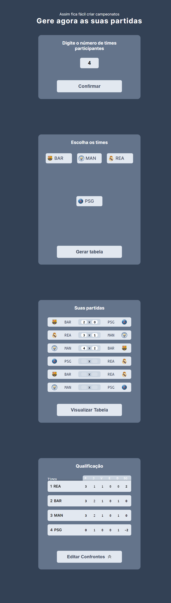

<h1 align="center">Gerador de Partidas na modalidade Mata-Mata</h1>

Este projeto foi desenvolvido com o intuito de solucionar um problema ao jogar campeonatos de fifa localmente e precisar de uma aplicação que gere os confrontos e atualize a tabela de classificação conforme inserido os dados 

  <a href="#-tecnologias">Tecnologias</a>&nbsp;&nbsp;&nbsp;|&nbsp;&nbsp;&nbsp;
  <a href="#-projeto">Projeto</a>&nbsp;&nbsp;&nbsp;|&nbsp;&nbsp;&nbsp;
  <a href="#-licença">Licença</a>

  

  <a href="https://rafaelr4mos.github.io/round-robin-matches-generator/generateMatches/" target="_blank">😁 -> Acesse o deploy do projeto!</a>

 

## 🚀 Tecnologias

Esse projeto foi desenvolvido com as seguintes tecnologias:

-   HTML
-   CSS (grid)
-   JS
-   Git e Github

## 💻 Projeto

O projeto é um gerador de partidas no formato mata-mata com o fornecimento de uma tabela em tempo real para atualizar as pontuações dos times

## 🔘 Licença

Esse projeto está sob a licença MIT.

---

Made with 💙 by Rafael Ramos
